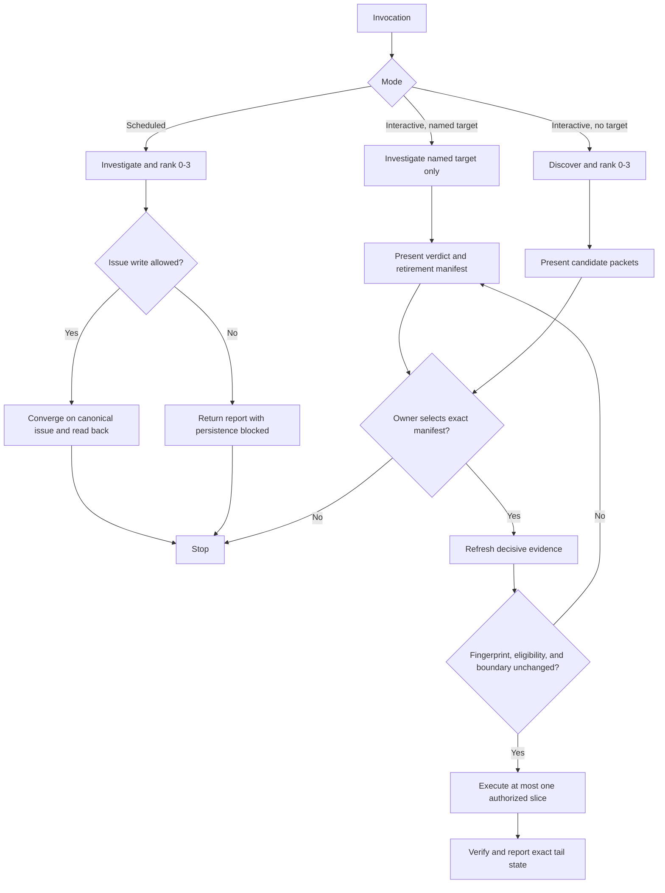
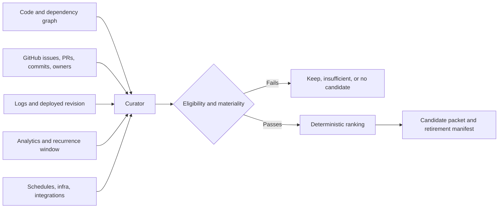

# Trash Truck Retirement Workflow - Plan

## Goal Capsule

- **Objective:** Repurpose Trash Truck from routine code-slop cleanup into an evidence-gated retirement workflow that finds or evaluates unused real-world surfaces, proposes the strongest candidates, and acts only after bounded owner selection.
- **Authority:** The Product Contract owns behavior. The Planning Contract owns implementation mechanisms. Target-repository instructions and explicit owner gates outrank both for GitHub writes, destructive changes, merges, deployments, schemas, data, infrastructure, and external systems.
- **Execution profile:** Multi-repository code and documentation change. Source implementation lives in `fellowship-dev/dogfooded-skills`; directly contradictory Pylot guidance is corrected in `fellowship-dev/pylot`.
- **Stop conditions:** Scheduled mode always stops after reporting or durable issue persistence. Interactive mode stops before mutation until the owner selects the exact candidate and retirement manifest. Any material evidence, scope, or reversibility change invalidates that selection.
- **Tail ownership:** Implementation may produce verified, reviewable PRs. Merge, deployment, schedule creation, live skill synchronization, and irreversible external retirement remain separately authorized owner actions.

---

## Product Contract

### Summary

Trash Truck becomes the active-pruning counterpart to routine quality sensors. It investigates whether a named surface is still needed or nominates up to three material retirement candidates from a repository and its direct operational dependencies. It uses available code, ownership, history, runtime, analytics, logs, schedules, infrastructure, and integration evidence; it records uncertainty honestly; and it prefers retirement over simplification only when the evidence supports that conclusion.

### Problem Frame

The current skill finds low-level static cleanup and opens PRs automatically. That duplicates modern janitorial workflows, cannot distinguish unused code from unused product or operational capability, and can mistake missing telemetry for non-use. A useful retirement workflow must test necessity across the system that exists in production, preserve investigation work durably, and separate recommendation from destructive authority.

### Actors

- A1. **Owner:** Selects or rejects a candidate and separately authorizes any gated destructive or production action.
- A2. **Interactive operator:** Runs the investigation, reconciles evidence, presents the candidate packet, and executes at most one selected retirement within the approved boundary.
- A3. **Scheduled operator:** Runs read-only investigation and may persist results under pre-authorized repository policy, but cannot retire anything.
- A4. **Evidence worker:** A read-only subagent or connector that gathers one bounded evidence surface without ranking, mutating, or deciding retirement.

### Requirements

**Invocation and scope**

- R1. The skill supports interactive discovery with no named candidate, interactive review of one named candidate, and scheduled discovery as three explicit modes.
- R2. A discovery run inspects the named repository and only direct operational dependencies identified by its configuration, deployment manifests, runtime identifiers, or authoritative documentation.
- R3. An interactive discovery run returns zero to three eligible candidates, ranked without padding, and stops for exact owner selection before any mutation.
- R4. An interactive named-target run investigates only that target, returns `retire`, `prune/simplify`, `keep`, or `insufficient evidence`, declares the proposed retirement boundary, and stops for go/no-go.
- R5. A scheduled run returns zero to three candidates, conditionally persists the investigation, and terminates with no route into code edits, deletion, PR creation, job disabling, schema or data changes, infrastructure mutation, merge, or deployment.

**Evidence and nomination**

- R6. Each candidate records evidence for retirement, evidence against retirement, known consumers and owners, last verified use, unresolved gaps, payoff, effort, risk, reversibility, and a retirement manifest with included and excluded surfaces.
- R7. Every evidence source records `observed`, `unavailable`, `failed`, or `not-applicable` plus its query and time window, collection time, environment, identity or denominator where relevant, and a secret-free receipt or link.
- R8. Runtime claims identify the deployed revision and environment; repository `main` alone is never production evidence.
- R9. Analytics and log windows cover the capability's expected recurrence or seasonality; a quiet but inadequate window cannot support retirement.
- R10. Unavailable, failed, stale, or wrong-environment telemetry lowers or caps confidence and is never interpreted as zero use.
- R11. Static non-reference findings are leads, not retirement candidates, until corroborated by real-world dependency, ownership, or runtime evidence; positive verified use blocks retirement eligibility.
- R12. Read-only evidence workers may gather independent surfaces concurrently, but one curator reconciles identities, contradictions, and freshness before ranking.

**Ranking and decision safety**

- R13. Candidates must clear a materiality floor and are then ranked deterministically by confidence times material payoff, discounted by retirement effort and risk, with component values and rationale persisted.
- R14. Candidate fingerprints derive from normalized repository identity and conceptual surface so evidence refreshes update an existing candidate instead of duplicating it.
- R15. Selection authorizes only the displayed candidate fingerprint and retirement manifest; a larger blast radius, irreversible external action, target drift, newly positive usage, or loss of eligibility invalidates approval and forces re-presentation.
- R16. Before execution, the operator refreshes every drift-prone source that materially supported the recommendation while reusing still-valid stable evidence.
- R17. A selected investigation may still end in `keep`, `insufficient evidence`, or no change when refreshed evidence defeats retirement.

**Durable scheduled output**

- R18. Scheduled mode uses at most one long-lived canonical retirement-review GitHub issue per repository, discovered with a stable repo-derived marker after searching open and closed issues and related pull requests.
- R19. The canonical issue preserves owner-authored discussion and stores machine-managed rankings and evidence packets in a bounded section or comments that can be updated idempotently.
- R20. Candidate lifecycle states are `proposed`, `selected`, `retired`, `kept`, `insufficient`, and `superseded`; rejected candidates remain suppressed until material evidence changes.
- R21. Scheduled runs are serialized per repository where supported, read back every create or update, and deterministically repair or report a deduplication race rather than creating issue churn.
- R22. A scheduled run checks repository policy and write authority before mutation. If GitHub is unavailable or writes are not authorized, it returns the investigation result with persistence marked blocked and never claims durable storage.
- R23. A first-ever run with no eligible candidates creates no issue. If a canonical issue already exists, a no-change update is appended only when evidence materially changed, and the skill does not auto-close the issue.

**Execution and completion evidence**

- R24. Interactive execution removes or simplifies the complete selected slice across code, tests, documentation, configuration, jobs, integrations, schemas, data, and infrastructure only where each surface is included and authorized in the approved manifest.
- R25. A pull request records a proposed retirement, not a completed retirement. `retired` requires exact deployed-revision and post-deployment usage evidence for production surfaces.
- R26. The workflow prefers deleting over simplifying, simplifying over optimizing, and optimizing over automating, while accepting `keep` or no change as successful outcomes.

### Key Flows

- F1. **Discover interactively**
  - **Trigger:** A user invokes Trash Truck for a repository without a candidate.
  - **Actors:** A1, A2, optionally A4.
  - **Steps:** Bound dependencies, collect evidence, disconfirm leads, rank eligible candidates, present zero to three packets, stop for exact selection, refresh material evidence, then execute at most one approved manifest or return no change.
  - **Outcome:** One bounded retirement proposal is executed to the authorized tail, or the run ends safely without mutation.
  - **Covered by:** R1-R3, R6-R17, R24-R26.
- F2. **Interrogate a named target**
  - **Trigger:** A user invokes Trash Truck with one candidate.
  - **Actors:** A1, A2, optionally A4.
  - **Steps:** Investigate the target without broad nomination, present a verdict and manifest, stop for go/no-go, refresh decisive evidence, then execute or abstain.
  - **Outcome:** The named target is kept, narrowed, retired to the authorized tail, or marked insufficient evidence.
  - **Covered by:** R1-R2, R4, R6-R17, R24-R26.
- F3. **Investigate on schedule**
  - **Trigger:** An authorized schedule invokes Trash Truck for one repository.
  - **Actors:** A3, optionally A4.
  - **Steps:** Gather and rank evidence, preflight repository policy and GitHub authority, converge on the canonical issue when persistence is allowed, read back the durable record, and terminate.
  - **Outcome:** Investigation is persisted once or returned with an honest persistence blocker; no retirement action occurs.
  - **Covered by:** R1-R3, R5-R14, R18-R23, R26.

### Acceptance Examples

- AE1. **No candidate is a valid result**
  - **Covers:** R3, R23, R26.
  - **Given:** A repository has no material, corroborated retirement candidate.
  - **When:** Interactive or scheduled discovery completes.
  - **Then:** The result says no change, presents no padded candidates, and creates no first-time issue.
- AE2. **Missing analytics does not become zero usage**
  - **Covers:** R7-R11, R13.
  - **Given:** Code and Git history suggest an obsolete surface but its analytics connector fails.
  - **When:** The candidate is evaluated.
  - **Then:** The failed source is recorded, confidence is reduced or capped, and the candidate cannot claim verified non-use.
- AE3. **Runtime evidence disproves a static lead**
  - **Covers:** R8, R11, R17.
  - **Given:** Static search finds no callers but production logs show recent use on the deployed revision.
  - **When:** Evidence is reconciled.
  - **Then:** The lead is blocked from retirement and the outcome is `keep` or no candidate.
- AE4. **Scheduled investigation cannot cross into execution**
  - **Covers:** R5, R18-R23.
  - **Given:** A scheduled run finds a high-confidence candidate.
  - **When:** It persists the ranking successfully.
  - **Then:** It terminates without editing code, opening a retirement PR, disabling anything, or deleting any surface.
- AE5. **Selection expires when the boundary changes**
  - **Covers:** R15-R17.
  - **Given:** The owner selected a candidate whose manifest excluded a database table.
  - **When:** refreshed evidence shows that retiring the candidate also requires dropping that table.
  - **Then:** The run stops and presents the expanded boundary for separate approval.
- AE6. **Repeated schedules converge**
  - **Covers:** R14, R18-R23.
  - **Given:** Two materially identical scheduled investigations run close together.
  - **When:** Both attempt persistence.
  - **Then:** Readback yields one canonical issue and one current candidate identity without duplicate issue churn.
- AE7. **Named target does not broaden itself**
  - **Covers:** R2, R4.
  - **Given:** The user asks whether one named subsystem should be retired.
  - **When:** Investigation finds unrelated cleanup opportunities.
  - **Then:** The verdict covers only the named subsystem and does not nominate or execute unrelated work.
- AE8. **A PR is not production retirement**
  - **Covers:** R24-R25.
  - **Given:** The selected slice has been removed in a green pull request.
  - **When:** The run reports status before deployment.
  - **Then:** The candidate remains `selected` or retirement-proposed and does not become `retired`.

### Success Criteria

- The skill's default identity is active evidence-gated retirement, not recurring code cleanup.
- Every mutation path is preceded by exact interactive selection and fresh decisive evidence.
- Scheduled and interactive behavior are distinguishable and fixture-tested.
- Repeated scheduled investigations preserve reusable work in one canonical issue without overwriting owner discussion.
- Five read-only or dry runs exercise the repurposed workflow before it is described as production-ready.

### Scope Boundaries

**Included**

- The Trash Truck skill contract, evidence and candidate packet protocol, deterministic ranking, mode and authority gates, durable GitHub issue behavior, evaluation fixtures, catalog copy, and contradictory Pylot documentation.
- Capability-aware use of GitHub history, commits, subagents, analytics, logs, schedules, infrastructure, and integrations when those surfaces are available and in scope.

**Excluded**

- Building new PostHog, Mixpanel, CloudWatch, or GitHub connectors.
- Creating or enabling a production schedule, syncing the skill into a live team, merging PRs, deploying changes, or performing an actual retirement.
- Portfolio-wide cross-repository nomination, vendor-account-wide scans, unrelated repositories, and transitive operational dependencies.
- Replacing routine linting, architectural refactoring, entropy checks, or dependency maintenance.

---

## Planning Contract

### Key Technical Decisions

- KTD1. **Replace the old janitor workflow rather than extend it.** Delete `skills/ops/trash-truck/pre-scan.sh` and rewrite the skill around retirement evidence because its debug-line, misplaced-file, and unused-function bias conflicts with the materiality and corroboration requirements. Code search remains one low-weight evidence surface implemented through ordinary tools or bounded workers.
- KTD2. **Use explicit mode input with a fail-safe default.** Define `mode:interactive` and `mode:scheduled`; interactive accepts an optional named candidate. An invocation that cannot prove an interactive owner is present behaves as scheduled/report-only. This makes the no-target and named-target branches explicit without inventing a fourth execution mode.
- KTD3. **Rank by deterministic expected net payoff.** Apply a materiality floor, then calculate a documented composite from confidence and material payoff discounted by effort and risk. Persist each component and rationale; keep blast radius and reversibility visible even when they are not collapsed into one score. (session-settled: user-directed — chosen over prioritizing the stalest or largest target: confidence-to-payoff gives the owner the strongest actionable candidates first.)
- KTD4. **Use one canonical review issue per repository.** Identify it with a stable repo-derived marker, keep its human-owned purpose and discussion intact, and write machine-owned investigation packets through an idempotent bounded block or comments. Reopen nothing automatically and do not create the issue for a first no-candidate run. (session-settled: user-directed — chosen over one issue per candidate: one durable review thread avoids issue churn and repeated investigation.)
- KTD5. **Treat owner selection as a fingerprinted capability.** Bind approval to normalized candidate identity plus the displayed manifest and evidence cutoff. Refresh supporting drift-prone evidence before action and invalidate the capability when scope, eligibility, deployed code, or irreversible impact changes.
- KTD6. **Keep evidence adapters capability-driven and portable.** Remove the current restrictive `allowed-tools` declaration. The skill probes available read-only tools and connectors, records each surface's status, and degrades to an honest evidence gap instead of assuming PostHog, Mixpanel, CloudWatch, GitHub, or subagents always exist.
- KTD7. **Centralize judgment in one curator.** Evidence workers receive bounded read-only questions and return source envelopes. They cannot rank, mutate, or declare retirement; the invoking agent reconciles identities, conflicts, recurrence windows, and deployed revisions.
- KTD8. **Make scheduled persistence policy-aware and idempotent.** Reuse the repository's issue-filing rules, search open and closed issues plus related PRs, serialize by repository where the host supports it, then read back create/update results and repair or report races deterministically.
- KTD9. **Test the behavioral contract with fixture-backed evaluation.** Add a dependency-free Python harness and JSON fixtures for mode safety, evidence semantics, deterministic ordering, selection invalidation, canonical-issue convergence, named-target containment, and honest no-change outcomes; register the harness in the repository's explicit CI allowlist.
- KTD10. **Stop implementation at reviewable proof.** Source changes may be committed and proposed through PRs in their owning repositories, but live skill sync, merge, deploy, schedule mutation, and external destructive actions require separate authority. Production candidate state changes to `retired` only after deployed-revision and post-deploy evidence.

### High-Level Technical Design

### Candidate and Issue State Model

The candidate packet is the shared contract between interactive presentation, scheduled persistence, and verification. It contains the conceptual fingerprint, current state, normalized score components, evidence envelopes, disconfirming evidence, unresolved gaps, exact manifest, exclusions, reversibility, and owner gates. Evidence collection timestamps and repo/deployed revisions are mutable observations; they do not change the conceptual fingerprint.

The canonical issue is a durable investigation ledger, not authorization. Its generated current-ranking block may be replaced idempotently while owner-authored prose remains untouched. Materially changed runs append a timestamped evidence packet or comment. `selected` records an owner decision against one fingerprint and manifest; `retired` additionally requires deployed and post-deploy receipts. `kept`, `insufficient`, and `superseded` prevent stale candidates from being re-presented until their material evidence changes.

### Assumptions

- Target repositories may expose different connectors and agent primitives, so the contract must be semantic rather than tied to one harness's tool names.
- GitHub is the preferred durable store when repository policy permits issue writes; the invocation result remains the fallback artifact when it does not.
- The repository contribution rule requiring five real exercises applies to this repurposing and can be satisfied with read-only or dry runs before any live retirement.

### Sequencing

1. Replace the source skill and define its reusable packet/state protocol before writing tests.
2. Add fixture-backed contract tests and CI registration before updating discovery copy.
3. Correct dogfooded-skills and Pylot documentation after the new contract is executable and testable.
4. Run static validation plus five dry/read-only exercises, then prepare reviewable PRs without crossing merge, sync, schedule, or deployment gates.

### System-Wide Impact

- **Authority:** The skill changes from automatic PR creation to explicit selection and scoped authority. Schedules become strictly report-only.
- **Evidence:** Production claims acquire deployed-revision, environment, recurrence-window, and source-status requirements.
- **GitHub:** Repeated scans converge on a repository ledger rather than creating candidate issue churn.
- **Skill portability:** Connector and subagent usage becomes optional and capability-discovered; no provider is a hard dependency.
- **Documentation:** Pylot's current L3 guidance must stop promising autonomous cleanup PRs from Trash Truck.

---

## Implementation Units

### U1. Replace the Trash Truck contract and remove the obsolete pre-scan

- **Repository:** `fellowship-dev/dogfooded-skills`
- **Goal:** Make the source skill express the three safe modes, evidence rules, ranking, selection boundary, execution tail, and no-change posture while deleting its obsolete static-cleanup machinery.
- **Requirements:** R1-R17, R24-R26.
- **Files:** `skills/ops/trash-truck/SKILL.md`; delete `skills/ops/trash-truck/pre-scan.sh`.
- **Approach:** Rewrite rather than layer exceptions onto the current workflow. Follow the repository's trigger-first skill structure with prerequisites, explicit inputs, numbered workflow, mode decision table, evidence-source table, error handling, and critical rules. Remove nonstandard `user-invocable` and `argument-hint` frontmatter plus the restrictive tool whitelist. Route static searches through the same source-envelope contract as every other evidence probe.
- **Test scenarios:** Interactive discovery stops at selection; named-target stays scoped; scheduled mode has no execution edge; zero or fewer than three candidates is valid; positive runtime use defeats a static lead; unknown telemetry cannot support zero-use language; refreshed evidence can invalidate selection.
- **Verification:** Contract harness from U3 passes; repository search finds no live invocation of the removed pre-scan; frontmatter matches the repository standard.
- **Dependencies:** None.

### U2. Define reusable evidence, candidate, and canonical-issue protocols

- **Repository:** `fellowship-dev/dogfooded-skills`
- **Goal:** Keep the main skill readable while making evidence collection, scoring, manifest approval, lifecycle, and durable issue behavior precise enough for independent agents to execute consistently.
- **Requirements:** R6-R23, R25-R26.
- **Files:** Add focused references under `skills/ops/trash-truck/references/`, including a candidate/evidence packet and canonical-issue protocol; link them from `skills/ops/trash-truck/SKILL.md`.
- **Approach:** Define one normative owner for each protocol. Specify evidence-source status and freshness fields, recurrence-window checks, score components and deterministic tie-breaking, conceptual fingerprints, candidate lifecycle transitions, manifest inclusions/exclusions, selection invalidators, issue marker and machine-owned boundary, readback, race recovery, and repository-policy preflight. Reuse issue-search and owner-text preservation patterns from `skills/product/create-compelling-issues/SKILL.md` rather than embedding provider-specific APIs.
- **Test scenarios:** Two runs with refreshed evidence retain one fingerprint; repeated or concurrent schedules converge on one issue; a closed canonical issue does not cause automatic reopening or duplicate churn; rejected candidates stay suppressed until material change; issue-write failure returns a persistence blocker; owner prose survives machine updates.
- **Verification:** U3 fixtures prove protocol invariants; all references are reachable from the main skill; no secret-bearing example payloads or provider-mandatory language is present.
- **Dependencies:** U1.

### U3. Add fixture-backed behavioral evaluation and CI coverage

- **Repository:** `fellowship-dev/dogfooded-skills`
- **Goal:** Turn the safety and ranking rules into an executable contract instead of relying on prose review.
- **Requirements:** R1-R26.
- **Files:** Add `skills/ops/trash-truck/evals/test_retirement_contract.py` and JSON fixtures under `skills/ops/trash-truck/evals/`; update `.github/workflows/tests.yml`.
- **Approach:** Use a dependency-free Python harness in the style of existing skill evals. Parse the skill and reference files, load every JSON fixture, evaluate deterministic ranking and lifecycle helpers represented by the fixture contract, and assert the presence and ordering of hard stops. Cover at least: credible retirement, static lead disproved by runtime use, missing telemetry, no candidate, fewer than three candidates, named-target containment, stale approval, scheduled write-only persistence, duplicate schedules, and PR-not-retired status.
- **Test scenarios:** Fixtures fail when missing telemetry is normalized to zero, when scheduled mode reaches execution, when a stale approval remains valid, when ranking changes under identical inputs, when duplicates create two canonical issues, or when a named target expands into discovery.
- **Verification:** `python3 skills/ops/trash-truck/evals/test_retirement_contract.py`; the CI entry-point guard reports an exact match; the full repository Actions test loop passes locally where platform-compatible.
- **Dependencies:** U1, U2.

### U4. Align source catalog and companion-skill copy

- **Repository:** `fellowship-dev/dogfooded-skills`
- **Goal:** Make every local discovery surface describe active retirement rather than dead-code cleanup.
- **Requirements:** R1-R5, R18-R26.
- **Files:** `README.md`, `skills/ops/popsicle/SKILL.md`, `skills/ops/popsicle/README.md`.
- **Approach:** Add Trash Truck to the ops catalog and replace stale companion copy. State that it investigates and proposes material retirements, that scheduled use is report-only, and that routine cleanup remains owned by other quality/refactor workflows.
- **Test scenarios:** Repository-wide search finds no claim that Trash Truck autonomously opens cleanup PRs or primarily removes duplicate/dead code.
- **Verification:** `rg -n "trash-truck|Trash Truck" README.md skills/ops/popsicle skills/ops/trash-truck` returns only the new identity; links resolve to existing paths.
- **Dependencies:** U1, U2, U3.

### U5. Correct Pylot's downstream operating guidance

- **Repository:** `fellowship-dev/pylot`
- **Goal:** Remove instructions that would schedule the repurposed skill to autonomously open cleanup PRs.
- **Requirements:** R5, R18-R23, R25.
- **Files:** `gateway/modules/skills/README.md`, `docs/agent-ready-levels.md`.
- **Approach:** Update the skill inventory, L3 definition, and sample schedule so scheduled Trash Truck investigates and maintains the canonical retirement-review issue only. Preserve the explicit slash-command-first task convention. Do not create, enable, or modify any live team schedule as part of this unit.
- **Test scenarios:** A reader cannot infer that scheduled Trash Truck deletes code or opens cleanup PRs; the sample task clearly terminates after report/issue persistence.
- **Verification:** Documentation search finds no contradictory old description; run Pylot's relevant documentation/static checks discovered during implementation.
- **Dependencies:** U1, U2.

### U6. Exercise the workflow and prepare reviewable delivery

- **Repositories:** `fellowship-dev/dogfooded-skills`, then `fellowship-dev/pylot`.
- **Goal:** Demonstrate that the repurposed workflow behaves safely across real repository shapes before claiming production readiness.
- **Requirements:** R1-R26.
- **Files:** PR descriptions and verification receipts; no live schedule or external-system mutations.
- **Approach:** Run at least five read-only or dry exercises spanning no candidate, fewer than three candidates, missing telemetry, positive runtime disconfirmation, named target, and scheduled issue behavior using a sandbox or mock where a GitHub write would otherwise occur. Record source availability, outcomes, false positives, and any prompt corrections. Prepare narrowly scoped PRs with exact test receipts and cross-links; do not merge or sync the live team skill.
- **Test scenarios:** Each exercise terminates in its intended safe state and none performs unapproved mutation. At least one plausible static candidate must be rejected by real-world evidence, and at least one run must validly return no change.
- **Verification:** Five run receipts are reviewable; dogfooded-skills CI passes; Pylot checks pass for its documentation diff; PR status is reported as retirement-workflow proposed, never deployed.
- **Dependencies:** U3, U4, U5.

---

## Verification Contract

| Gate | Applies to | Command or evidence | Pass condition |
|---|---|---|---|
| Trash Truck behavioral contract | U1-U3 | `python3 skills/ops/trash-truck/evals/test_retirement_contract.py` | All fixtures parse and every mode, evidence, ranking, lifecycle, approval, and deduplication invariant passes. |
| Explicit CI entry-point registry | U3 | Run the guard block from `.github/workflows/tests.yml` or the complete workflow locally | Files on disk exactly equal the workflow's explicit test list. |
| Dogfooded-skills full tests | U1-U4, U6 | Execute every listed Python and shell test using the workflow loop | No test entry point fails. |
| Removed workflow references | U1, U4 | `rg -n "pre-scan|focus:dead-code|opens? (targeted )?cleanup PR|removes dead/duplicate" skills/ops/trash-truck README.md skills/ops/popsicle` | No live old-contract instruction remains. |
| Pylot downstream copy | U5 | `rg -n -C 2 "trash-truck" gateway/modules/skills/README.md docs/agent-ready-levels.md` plus discovered doc checks | Every reference says scheduled investigation/reporting and none promises autonomous cleanup. |
| Five real exercises | U6 | Review receipts for five read-only/dry runs | Required scenario diversity is present, evidence gaps are honest, and no unapproved mutation occurred. |
| Live distribution readback | Post-merge owner-gated tail | After an authorized sync, use the Pylot skill file/readback verification documented in `gateway/modules/skills/README.md` | Runtime content hash and files match the merged source skill. This gate is not required to open the source PR. |
| Production retirement status | Future actual candidate only | Deployed revision plus post-deploy logs/analytics and canonical issue state | A candidate becomes `retired` only after the complete manifest is deployed and absence of use is verified across an adequate window. |

### Quality Gates

- Inspect both repository worktrees before edits and stage only implementation-owned files.
- Keep fixture data synthetic and secret-free.
- Validate that scheduled-mode instructions contain no fallthrough into interactive execution.
- Validate that every full behavioral rule has one normative owner and linked references do not contradict it.
- Remove abandoned experiments from the final diff.

---

## Definition of Done

- D1. `skills/ops/trash-truck/SKILL.md` implements R1-R26 and the obsolete `pre-scan.sh` is deleted with no dangling references.
- D2. The evidence packet, deterministic scoring, retirement manifest, approval invalidation, candidate lifecycle, and canonical issue rules are defined once and linked from the skill.
- D3. Fixture-backed behavioral tests cover every acceptance example and are registered in `.github/workflows/tests.yml`.
- D4. Dogfooded-skills catalog and Popsicle companion copy describe the new identity without claiming automatic cleanup.
- D5. Pylot documentation no longer instructs teams to schedule Trash Truck to open cleanup PRs.
- D6. The full dogfooded-skills test suite and relevant Pylot checks pass from clean baselines.
- D7. Five read-only or dry exercises demonstrate safe abstention, evidence disconfirmation, missing-telemetry handling, bounded named-target behavior, and scheduled persistence behavior.
- D8. Reviewable PRs contain exact receipts and make no merge, deployment, live skill-sync, schedule, or external retirement claim.
- D9. No dead-end scripts, duplicate protocols, temporary fixtures, or abandoned implementation paths remain in either final diff.

### Risks and Dependencies

| Risk or dependency | Consequence | Mitigation |
|---|---|---|
| Evidence providers differ by repository and harness | The workflow could overclaim completeness or become provider-specific. | Capability discovery plus explicit source statuses; absence caps confidence. |
| Sparse or seasonal usage | A genuinely used annual or exceptional path could look dormant. | Require recurrence-aware windows, owner/consumer evidence, and positive-use vetoes. |
| Issue races or owner edits | Scheduled runs could duplicate issues or overwrite human context. | Stable marker, conceptual fingerprints, serialization where available, bounded machine ownership, and readback repair. |
| Destructive scope expands during execution | Prior approval could be misapplied to schemas, data, jobs, or infrastructure. | Manifest-bound selection and mandatory re-presentation on any material boundary change. |
| Source and runtime skill drift | Documentation and tests could be green while Pylot still serves the old skill. | Keep live readback as an explicit post-merge gate and avoid deployment claims before it passes. |
| Cross-repository delivery | One PR may land while downstream guidance remains contradictory. | Cross-link PRs and do not describe the migration complete until both source and documentation changes are reviewable and consistent. |

### Sources and Research

- `skills/ops/trash-truck/SKILL.md` and `skills/ops/trash-truck/pre-scan.sh` establish the obsolete static-cleanup contract.
- `README.md` and `skills/meta/skill-builder/SKILL.md` establish frontmatter, authoring, catalog, and five-run contribution rules.
- `skills/product/create-compelling-issues/SKILL.md` establishes issue deduplication, repository-policy, and owner-text preservation patterns.
- `.github/workflows/tests.yml` establishes the explicit test-entry-point registry.
- `skills/ops/popsicle/SKILL.md` and `skills/ops/popsicle/README.md` contain stale companion descriptions.
- `fellowship-dev/pylot` files `gateway/modules/skills/README.md` and `docs/agent-ready-levels.md` contain downstream autonomous-cleanup guidance.
- Dogfooded-skills retirement commits `d9c0326`, `8fa0cd0`, and `8b870ef` demonstrate evidence-led deletion of superseded workflows and complete reference cleanup.
